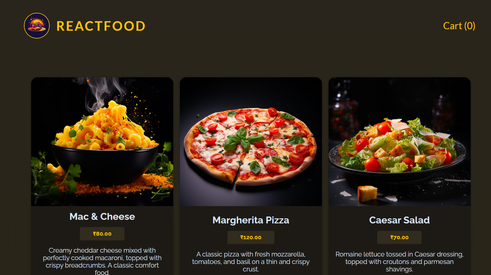

<h1 align="center">🍔 React Food Order App</h1>

## 🚀 Tech Stack & Concepts

This project is built using **ReactJS** and demonstrates intermediate React concepts around **state management**, **side effects**, and **data fetching**:

- ✅ **ReactJS Fundamentals**
- 🔄 **HTTP requests with `fetch`**
- 🌐 **State sharing with Context API**
- 🔁 **Side effects and cleanup with `useEffect`**
- 🧠 **Optimized function references with `useCallback`**
- 🛒 **Cart management and dynamic rendering**
- 🎨 **Clean & modular UI with conditional styling**

---

## 🔗 Demo

- 👉 <a target="_blank" href="https://react-food-order-app-vamh.onrender.com/">Click here</a> to try the Food Order App live!



The app allows users to browse available meals, add them to a cart, and submit an order. It communicates with a backend server (e.g., Firebase or mock API) to send order data.

---

## 📖 Features

- ✅ Browse a list of meals fetched from a remote database
- ➕ Add/remove meals from a cart
- 🛒 View cart modal with total amount
- 📦 Submit order form and send POST request to backend
- 🧼 Handles loading states, error handling, and `useEffect` cleanup
- 🧩 Reusable components and context-based state management

---

## 🧩 Key Concepts in Action

| Concept        | Usage                                                           |
| -------------- | --------------------------------------------------------------- |
| `useEffect`    | Fetch meals and handle cleanup during async tasks               |
| `useCallback`  | Optimize handlers passed to components                          |
| Context API    | Manage cart state globally across components                    |
| HTTP Requests  | Fetch meals via `GET`, submit orders via `POST`                 |
| Conditional UI | Show loader, error messages, cart modals, and forms dynamically |

---

## 🛠️ How to Run Locally

To get this project running on your machine:

```bash
# 1. Clone the repository
git clone https://github.com/shashankhl/react-food-order-app.git

# 2. Navigate to the project folder
cd react-food-order-app

# 3. Install dependencies
npm install

# 4. Start the development server
npm start
```

## :mailbox: Contact

- <a target="_blank" href="www.linkedin.com/in/shashank-hl">LinkedIn</a>
